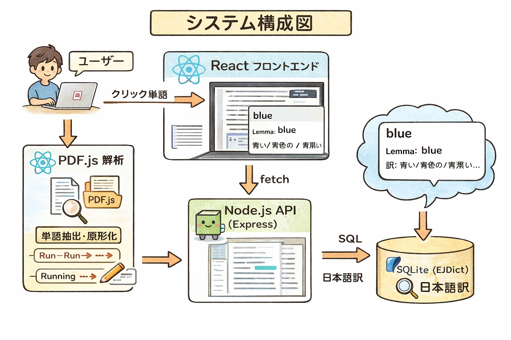

# HowToPdfTransrator


##使い方
起動方法

クローン後、以下を実行する。

フロントエンド
1. cd frontend
2. npm install
3. npm run dev
バックエンド
1. cd backend
2. npm install
3. npx ts-node src/server.ts

## 1. システム概要

本システムは、PDF内の英単語をクリックすると日本語訳をポップアップ表示するWebアプリケーションである。

主な処理の流れは以下の通り。

1. PDFを読み込む
2. PDF内のテキスト位置情報を取得
3. クリックされた座標から該当単語を特定
4. 単語の正規化および原形化を行う
5. SQLite辞書（EJDict）から日本語訳を検索
6. ポップアップで表示

本システムは生成AIを使用せず、以下の技術で構成されている。

* PDF解析（PDF.js）
* 単語抽出・整形
* 辞書検索（SQLite）

---

## 2. 開発環境

### フロントエンド

* React
* TypeScript
* Vite
* pdfjs-dist（PDF表示）

### バックエンド

* Node.js
* Express
* SQLite3
* ts-node（開発時実行）

### データ

* EJDict（英和辞書）
* SQLite形式（ejdict.sqlite3）

---

## 3. ディレクトリ構成

```
PDF_Analyzer/
├─ frontend/                 # フロントエンド（React）
│  ├─ src/
│  │  ├─ components/
│  │  │  └─ PdfViewer.tsx   # PDF表示・単語検出
│  │  ├─ App.tsx            # UIと翻訳ロジック
│  │  ├─ index.tsx
│  │  └─ index.css
│  ├─ public/
│  ├─ package.json
│  └─ vite.config.ts
│
├─ backend/                 # バックエンド（API）
│  ├─ src/
│  │  └─ server.ts          # 辞書検索API
│  ├─ package.json
│  └─ tsconfig.json
│
├─ data/                    # 辞書データ
│  ├─ db/
│  │  └─ ejdict.sqlite3
│  └─ temp/
│
├─ tools/
│  └─ sqlite3.exe
│
├─ docs/
│
└─ README.md
```

---

## 4. システム構成図

```
[ユーザー]
     ↓
[React フロントエンド]
     ↓ クリック単語
[PDF.js 解析]
     ↓
[単語抽出・原形化]
     ↓ fetch
[Node.js API (Express)]
     ↓ SQL
[SQLite (EJDict)]
     ↓
[日本語訳]
     ↓
[ポップアップ表示]
```

---

## 5. システム作成手順

### Step 1: フロントエンド構築

1. Vite + React + TypeScript 環境を作成

```
npm create vite@latest
```

2. 必要ライブラリをインストール

```
npm install
npm install pdfjs-dist
```

---

### Step 2: PDF表示機能の実装

* PDF.js を使用してPDFを描画
* Canvasにページを描画
* テキスト情報（textContent）を取得

---

### Step 3: 単語検出機能

* `textContent.items` から文字列取得
* 空白で分割して単語化
* 各単語の座標とサイズを保持
* クリック座標から該当単語を特定

---

### Step 4: 単語整形処理

#### 正規化

* 小文字化
* 記号除去

#### 原形化（lemmatize）

* ing, ed, ies, s などの処理
* 不規則動詞対応

例:

* running → run
* studies → study
* boxes → box

---

### Step 5: バックエンド構築

1. backend フォルダに移動

```
cd backend
```

2. 初期化

```
npm init -y
```

3. 必要ライブラリインストール

```
npm install express sqlite3 cors
npm install -D typescript ts-node @types/node @types/express
```

---

### Step 6: API作成

`server.ts`

* `/lookup?word=xxx` を作成
* SQLiteから単語検索

SQL例:

```sql
SELECT word, mean FROM items WHERE word = ?
```

---

### Step 7: フロントとAPI連携

* fetchでAPI呼び出し

```
http://localhost:3001/lookup?word=run
```
* レスポンスの意味をポップアップ表示
---

### Step 8: 動作確認

1. backend起動

```
npx ts-node src/server.ts
```

2. frontend起動

```
npm run dev
```

3. ブラウザで確認

* PDF表示
* 単語クリック
* 日本語訳表示

---

## 6. 今後の拡張

* 辞書結果の整形（短くする）
* キャッシュ機能
* 発音機能（音声）
* モバイル対応
* アプリ化（Electron / PWA）

---

## 7. まとめ

本システムは以下の3要素で構成される。

* PDF解析
* 単語抽出・原形化
* 辞書検索

シンプルな構造ながら、実用的な英語学習ツールとして利用可能である。


  VITE v8.0.8  ready in 1464 ms

  ➜  Local:   http://localhost:5173/
  ➜  Network: use --host to expose
  ➜  press h + enter to show help

package.json
👉 依存関係の心臓
package-lock.json
👉 バージョン固定（基本残す）
tsconfig.json
👉 TypeScriptの設定
tsconfig.app.json
👉 フロント用設定
tsconfig.node.json
👉 Node用設定
vite.config.ts
👉 Viteの設定
